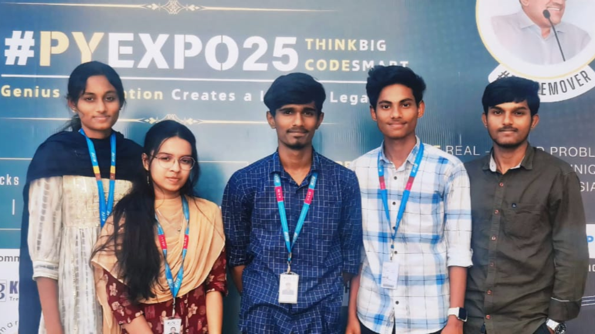

---

## Problem Statement

Problem Statement ID – PY036

An intent to expediate the investigation for any crime scene or to take preventive action to neutralize an intended antisocial activity (information received through intel), we wish to implement an extended application of Facial Recognition System(FRS).Real Time validation of individuals with crime history,Movement Tracking of Suspects,Identification of People loitering in Unauthorized area,Smart Police Deployment.  
---

## Overview
OVERVIEW:
Our Smart Policing System utilizes facial recognition and AI by :

Ø Implementing Real-Time Identification of a suspect

Ø Reducing Human Errors

Ø Lowering time consumption

Ø Improving Crime Prevention

Smart Policing System is designed to serve a wide range of
clients including national security, law enforcement, border
patrol, and immigration checks, etc…
SOLUTION:
This system automates decision making using facial recognition.It enhances the efficiency of agencies by enabling real-time facial recognition of suspects.By combining facial recognition and Intelligent Surveillance, we can predict criminals by monitoring their presence in an area.

---

## Team Members

Team ID – T080
 
List your team members along with their roles.

- Mourish Antony C - AI&ML Model Developer
- Harini M - Frontend Developer
- Natarajan V - Backend Developer
- Tejaashri K - Frontend Developer
- Vinu Karthick D - Frontend Developer

---

## Technical Stack

List the technologies and tools used in the project. For example:

- Frontend: HTML, CSS, JavaScript,
- Backend: Flask
- Database: MySQL
- Other Tools:  Git,TensorFlow,open CV,mediapip

---

## Getting Started

Follow these steps to clone and run the application locally.

### Prerequisites

1. Install [Python](https://www.python.org/downloads/).
2. Install [Git](https://git-scm.com/).
3. Clone this repository:
   bash
   git clone https://github.com/username/repository-name.git
   

### Installation

1. Navigate to the project directory:
   bash
   cd repository-name
   
2. Create a virtual environment:
   bash
   python -m venv venv
   
3. Activate the virtual environment:
   - On Windows:
     bash
     venv\Scripts\activate
     
   - On macOS/Linux:
     bash
     source venv/bin/activate
     
4. Install dependencies:
   bash
   pip install -r requirements.txt
   
5. Navigate to source
   bash
   cd source
   

---

## Start the Application

1. Run the Flask application:
   bash
   flask run
   
2. Open your browser and navigate to:
   
   http://127.0.0.1:5000/
   

---

## UI Overview

Images to demonstrate the user interface:

Example pages:

1. Landing Page:
   

2. Dashboard:
   

3. Analytics View:
   

---

## Resources

### 📄 PowerPoint Presentation
[Click here to view the PPT](insert-drive-link-here)

### 🎥 Project Video
[Click here to view the project demo video](https://drive.google.com/file/d/1OV7FsdaieAxUQG7ytJESqcyVHYsfpPW9/view?usp=drive_link)

### 📹 YouTube Link
[Watch the project on YouTube](https://drive.google.com/file/d/1OV7FsdaieAxUQG7ytJESqcyVHYsfpPW9/view?usp=drive_link)

---
